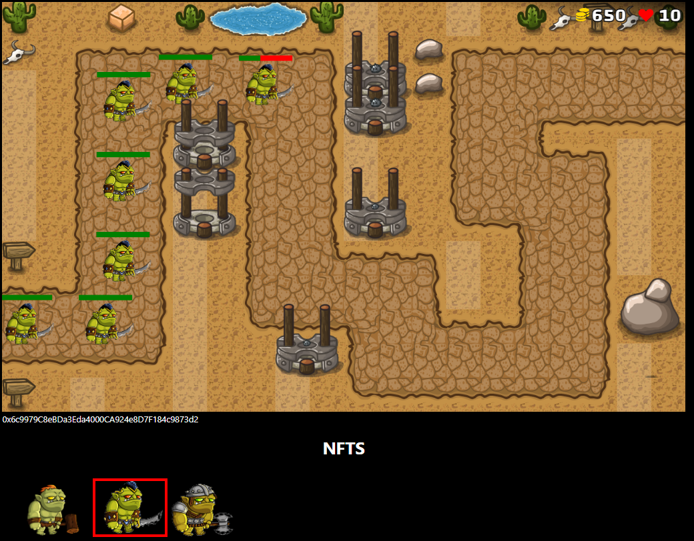

# Tower Defense Game with NFTs



install npm and ganache with:

```
    npm install --g truffle@5.4.1
    npm install ganache --global
```

cd to the folder 'blockchain-developer-bootcamp-final-project-main' and then run:

```
    npm install
    npm compile
    npm migrate
```

copy paste the GameToken.json file from 'build/contracts/' to the GameToken.js file in public/ but add 'GameToken =' in the beggining of the .js file. 

run the game with:
```
    npm run start
```